# CarRental 🚗

Car Rental Application with designated for agency managers and administrator the functionalities : \
For manager 👨‍💼: 
- Login :lock:
- View Cars with Filter / View Single Car 👁️
- Add Car :pencil2:
- Add Reservation ➕
- Manage Clients (CRUD)
- Check stats 📊 provided by in dashbord \
For Admin 🛠️: 
- Manage Managers 👨‍💼 (CRUD)
- Check managers Performance and Revenue 📊 \
Some other Specialities ⚙️ : 
- ⚠️ : To be A client 👤 you have to rent at least a car, that's why when adding reservation the manager can either chose an existing client or to add a new client -> A client can be added only during the reservation process
- Before each reservation, the system checks if the car is already booked or not.
- After a reservation is made, it status is "appending" and waiting for the same or other manager to confirm it .
- the manager that added the reservation is known along with the one that accepted ✅/ refused it ❌ .
- An Invoice 📄 is Downloaded after a resrvation is accepted ✅

## Conception
- Class Diagram

- Use Case Diagram
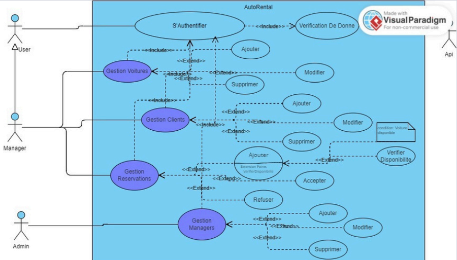

## Demo
- **ADMIN** :
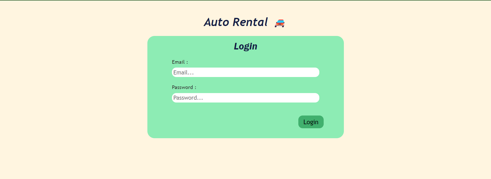
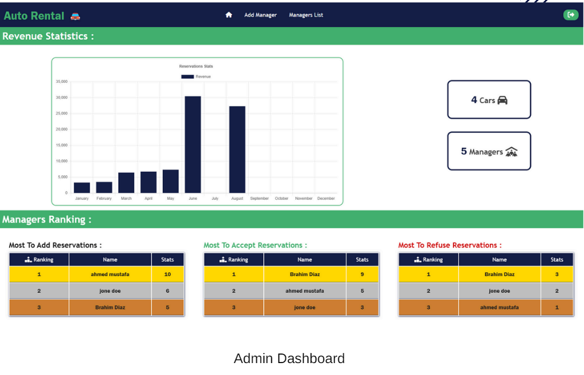
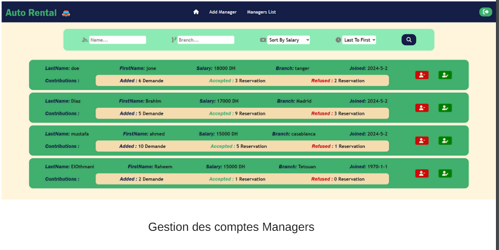
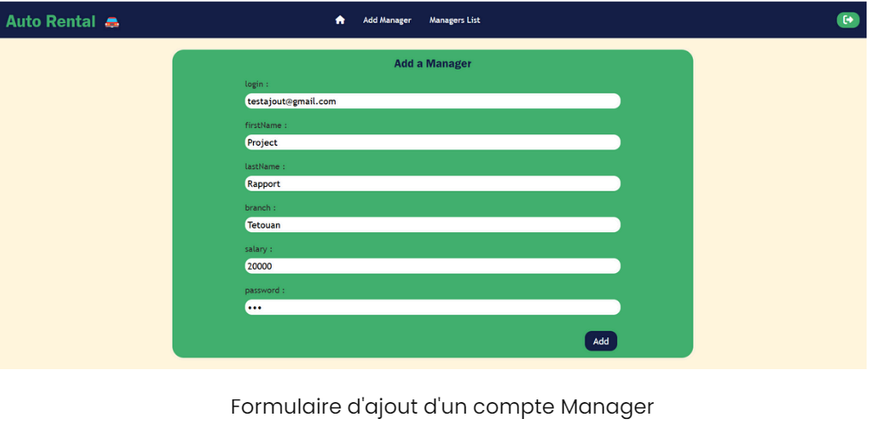
- **MANAGER** : 
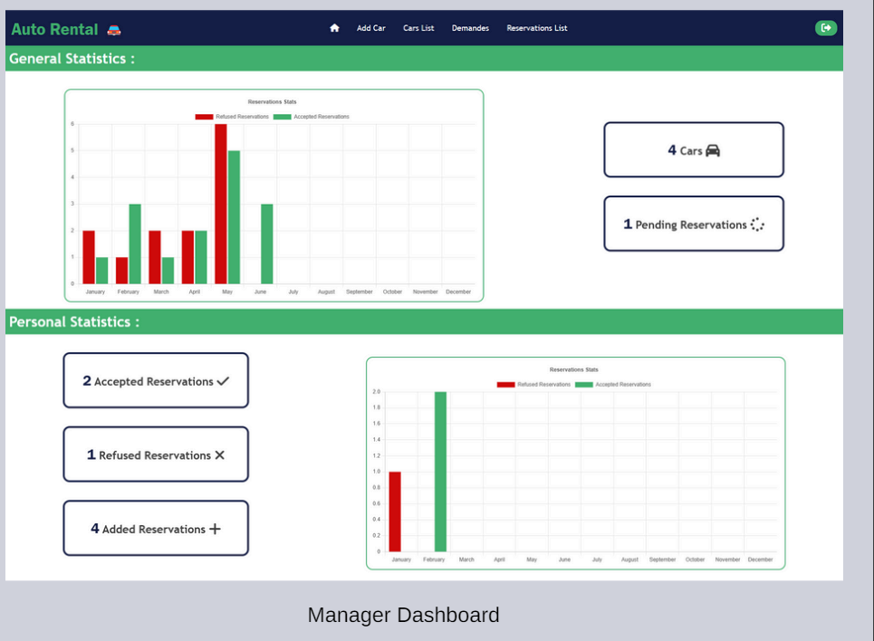
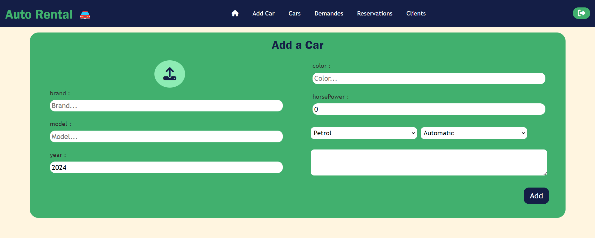
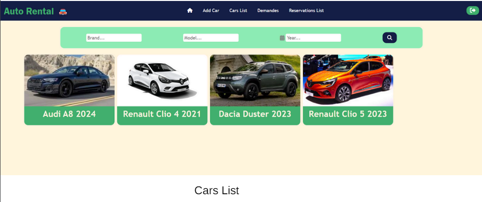
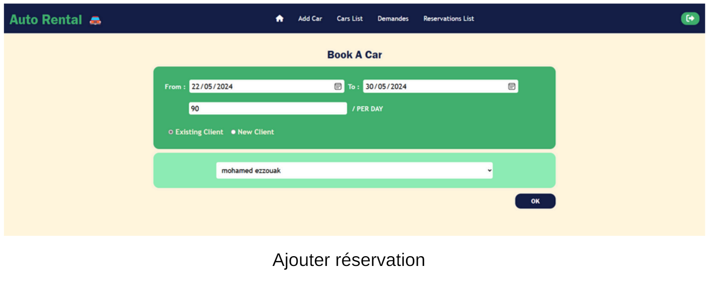
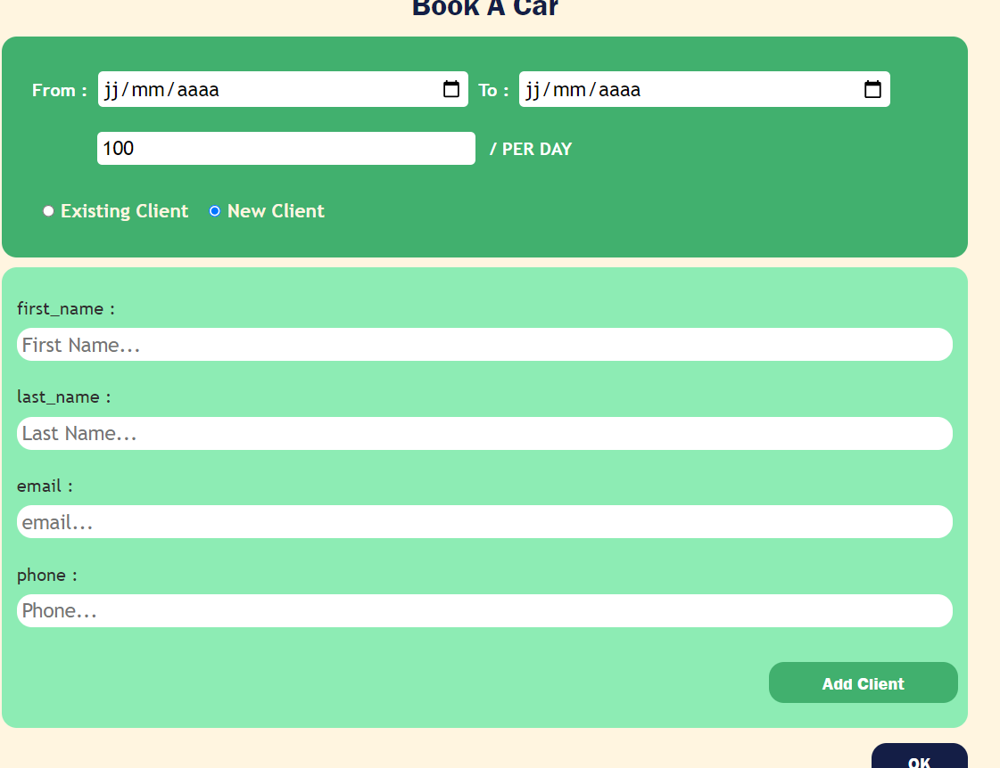
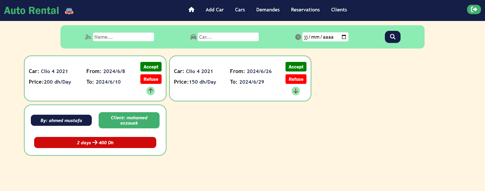
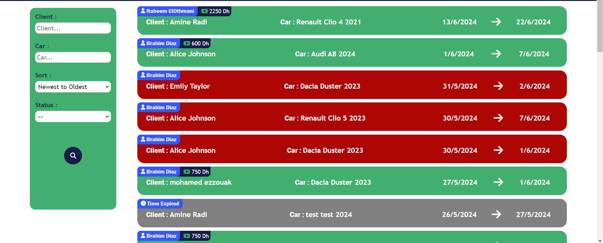
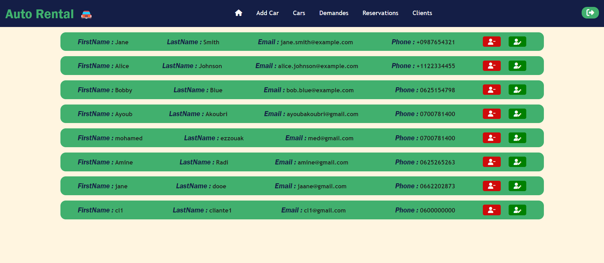

## Acknowledgements

 - [Awesome Readme Templates](https://awesomeopensource.com/project/elangosundar/awesome-README-templates)
 - [Awesome README](https://github.com/matiassingers/awesome-readme)
 - [How to write a Good readme](https://bulldogjob.com/news/449-how-to-write-a-good-readme-for-your-github-project)

